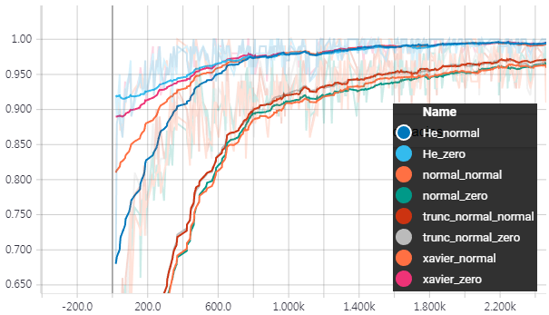

# compare_initializers
Performance comparison of various weight and bias initializers using MNIST dataset

### Network architecture
* hidden layers: Two fully-connected layer (256 nodes, respectively) with ReLU
* output layer: Fully-connected layer (10 nodes = # of class for MNIST)
* Batch normalization is used for hidden layers
### Used initializers
* Weight initializer: Normal, Truncate normal, Xavier, He initializer
* Bias initializer: Constant (zero), Normal initializer
## Results
Training accuracies of classifying MNIST data are compared.
* Loss values are plotted using [Tensorboard in PyTorch](https://github.com/yunjey/pytorch-tutorial/tree/master/tutorials/04-utils/tensorboard).
<table align='center'>
<tr align='center'>
</tr>
<tr>
<td>
<td>
</tr>
</table>

### References
1. https://github.com/hwalsuklee/tensorflow-mnist-MLP-batch_normalization-weight_initializers
